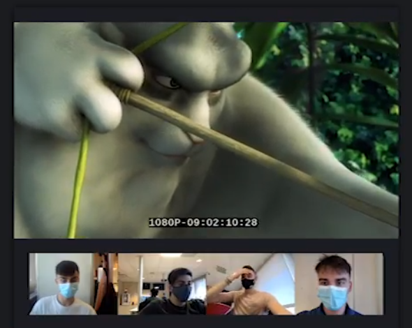

<a id="3rdParties-top"> </a>

<a href="https://nexplayer.github.io/NexPlayer_HTML5_Documentation/#/"></a>

***

# Third Party

This is a summary of how to use third party tools

## Agora

Agora allows us to give you the chance to see a video with your friends



### Using with the player

To start, you need to have a channel set up in Agora. You can do that by creating an account in the following link: https://www.agora.io/en.

In order to use it, you need to create a div with the “agoraContainer” id, inside of the player container.

```html
<div id="player_container">
		<div id="player"></div>
		<div id="agoraContainer"></div>
	</div>

 ```

After, all you need to do is add the agoraOptions object to your setup.

<a id="agoraOptions"></a>

#### agoraOptions : <code>Object</code>
**Type**: global typedef  
**Properties**:

| Param | Type | Description |
| --- | --- | --- |
| channel | <code>String</code> | The name of your channel. |
| token | <code>string</code> | The Token of you channel. |
| appid | <code>string</code> | Your AppId. |

And your setup should looks like this:

```js
nexplayer.Setup({
				key: "REPLACE THIS WITH YOUR CUSTOMER KEY",
				div: document.getElementById('player'),
				autoplay: true,
				mutedAtStart: true,
				showingFullUI: true,
				debug: false,
				callbacksForPlayer: callBackWithPlayers,
				src: "VIDEO URL",
				agoraOptions: {
                    token: "YOUR CHANNEL TOKEN",
                    channel: "YOUR CHANNEL NAME",
                    appid: "YOUR APPID"
                },
			});

        }
 ```

### Agora API

<a id="joinAgora"> </a>  

   #### player.joinAgora()

   You need to have a previous config given to agora before naming this function. If all is correct, you will be able to join the given Agora channel.

   **Type**: instance method of [<code>Player</code>](#Player)

<a id="leaveAgora"> </a>  

   #### player.leaveAgora()

   Left the Agora channel.

   **Type**: instance method of [<code>Player</code>](#Player)
