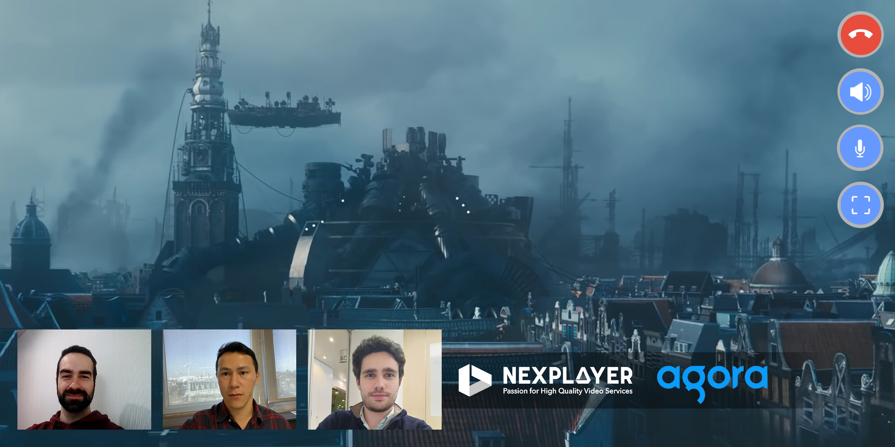

<a id="3rdParties-top"> </a>

<a href="https://nexplayer.github.io/NexPlayer_HTML5_Documentation/#/"></a>

***

# Third Party

This is a summary of how to use third party tools

***

## Agora

Agora allows us to give you the chance to see a video with your friends



### Using with the player

To start, you need to have a channel set up in Agora. You can do that by creating an account in the following link: https://www.agora.io/en.

In order to use it, you need to create a div with the “agoraContainer” id, inside of the player container.

```html
<div id="player_container">
		<div id="player"></div>
		<div id="agoraContainer"></div>
	</div>

 ```

After, all you need to do is add the agoraOptions object to your setup.

<a id="agoraOptions"></a>

#### agoraOptions : <code>Object</code>
**Type**: global typedef  
**Properties**:

| Param | Type | Description |
| --- | --- | --- |
| channel | <code>String</code> | The name of your channel. |
| token | <code>string</code> | The Token of you channel. |
| appid | <code>string</code> | Your AppId. |

And your setup should look like this:

```js
nexplayer.Setup({
				key: "REPLACE THIS WITH YOUR CUSTOMER KEY",
				div: document.getElementById('player'),
				autoplay: true,
				mutedAtStart: true,
				showingFullUI: true,
				debug: false,
				callbacksForPlayer: callBackWithPlayers,
				src: "VIDEO URL",
				agoraOptions: {
                    token: "YOUR CHANNEL TOKEN",
                    channel: "YOUR CHANNEL NAME",
                    appid: "YOUR APPID"
                },
			});

        }
 ```

### Agora API

<a id="joinAgora"> </a>  

   #### player.joinAgora()

   You need to have a previous config given to agora before naming this function. If all is correct, you will be able to join the given Agora channel.

   **Type**: instance method of [<code>Player</code>](#Player)

<a id="leaveAgora"> </a>  

   #### player.leaveAgora()

   Left the Agora channel.

   **Type**: instance method of [<code>Player</code>](#Player)

***

## Mux Data

Mux data allows you to monitor your video streaming performance.


### Using with the player

To start, you need to have a ENV_KEY from the <a href="https://dashboard.mux.com/environments">Mux environments dashboard</a>. ENV_KEY is a client-side key used for Mux Data monitoring.  These are not to be confused with API tokens which are created in the admin settings dashboard and meant to access the Mux API from a trusted server.

In order to use it, you need to import this three files into the html and set the muxPlayerInitTime.

```html
<head>
  <script type="text/javascript" src="https://src.litix.io/core/4/mux.js"></script>
  <script>window.muxPlayerInitTime = Date.now()</script>
</head>
<body>
	<script type="text/javascript" src="NexMuxHandShake.js"></script>
	<script type="text/javascript" src="config.js"></script>
</body>

 ```

 You can find <a href="https://github.com/NexPlayer/NexPlayer_HTML5_Mux/blob/main/app/config.js">confing.js</a> and <a href="https://github.com/NexPlayer/NexPlayer_HTML5_Mux/blob/main/app/NexMuxHandShake.js">NexMuxHandShake.js</a> in the following <a href="https://github.com/NexPlayer/NexPlayer_HTML5_Mux">repository</a>.

 First you should configure your settings in "config.js".

#### muxConfig : <code>Object</code>
**Properties**:

| Param | Type | Description |
| --- | --- | --- |
| debug | <code>boolean</code> | Enable or disable debug mode |
| disableCookies | <code>boolean</code> | Disable or enable the cookie that Mux use to track playback across subsequent page views if desired. |
| respectDoNotTrack | <code>boolean</code> | By default, mux does not respect Do Not Track when set within browsers. This can be enabled or disabled by this property. |
| automaticErrorTracking | <code>boolean</code> | Enable or disable automatic error tracking completely. |
| data | <code>Object</code> | Site, player and video metadata. |


And your muxConfig should look like this:

```js
var muxConfig = {
  debug: true,
  disableCookies: true,
  respectDoNotTrack: true,
  automaticErrorTracking: true,
  data: {
    env_key: 'ENV_KEY', // required

    // Site Metadata
    viewer_user_id: '', // ex: '12345'
    experiment_name: '', // ex: 'player_test_A'
    sub_property_id: '', // ex: 'cus-1'

    // Player Metadata
    player_name: 'NexPlayer', // ex: 'My Main Player'
    player_version:  '', // ex: '1.0.0'
    player_init_time: window.muxPlayerInitTime, // ex: 1451606400000

    // Video Metadata
    video_id: '', // ex: 'abcd123'
    video_title: '', // ex: 'My Great Video'
    video_series: '', // ex: 'Weekly Great Videos'
    video_duration: '', // in milliseconds, ex: 120000
    video_stream_type: '', // 'live' or 'on-demand'
    video_cdn: '' // ex: 'Fastly', 'Akamai'
  },
};
 ```

 NexMuxHandshake should be created in the callBackWithPlayers after the event "loadeddata" is fired. This object links Nexplayer and Mux events and functions.

 ```js

  let nexMux = null;

    var callBackWithPlayers = function (nexplayerInstance, videoElement) {

      player = nexplayerInstance;
      videoElem = videoElement;

      videoElem.addEventListener("loadeddata", function() {

        nexMux = new NexMuxHandShake();
        // To use ad metrics, set useAdMetrics to true, it is set to false by default.
        nexMux.useAdMetrics = true;
        nexMux.initMuxData();
      });
    }
 ```

If your application plays multiple videos back-to-back in the same video player, you should modify the muxConfig variable created in config.js an then use the following code.

```js
nexMux.videoChange(muxConfig);
 ```

In some cases, you may have the program change within a stream, and you may want to track each program as a view on its own. To do so you should modify the muxConfig variable created in config.js an then use the following code.

```js
nexMux.programChange(muxConfig);
```


***

## Verimatrix Watermarking

Verimatrix Watermarking allows the customers, the chance to use their own Watermark in order to get more secure in their content, during the playback.

### Using with the player

To start, you need to import the watermark.min.js file, to get it you should request it here https://www.verimatrix.com/products/watermarking/.


```html

<!DOCTYPE html>
<html>
<head>
	<meta charset="UTF-8">
	<meta name="viewport" content="width=device-width, initial-scale=1.0, maximum-scale=1.0, user-scalable=no" />
	<title>NexPlayer</title>
	<style type="text/css">
			/* "YOUR STYLE" */
	</style>
</head>
<body>
	<div id="player_container">
		<div id="player" width="560" height="315"></div>
	</div>
	<script src="YOUR watermark.min.js FILE URL"></script>
	<script src="YOUR nexplayer.js FILE"></script>
	<script>

		var player = null;
		var videoElem = null;
		var callBackWithPlayers = function (nexplayerInstance, videoElement) {
			player = nexplayerInstance;
			videoElem = videoElement;
			let FLogoImage = new Image();
			FLogoImage.src = "YOUR WATERMARK IMG URL";
			let wmInfo = {
				"strength" : 255, // WATERMARK STRENGTH (1-255)
				"transactionId": 12424, // REQUIRED FOR WmSdInitWatermark(). TRANSACTION OR USER IDENTIFIER.
				"videoParentElement": videoElem.parentElement, // YOUR VIDEO ELEMENT PARENT 
				"videoElement": videoElem, // YOUR VIDEO ELEMENT ID 
				"apiToken": 't1EKhe8A', // OPTIONAL. OPAQUE STRING FOR ACTIVATING SUBSEQUENT API ACTIONS
				"logoImage": FLogoImage, // OPTIONAL. SET A VISIBLE IMAGE TO DRAW IN ADDITION TO THE IMPERCEPTIBLE WATERMARK
				"logoPos": [ 15, 20, 269, 100 ], // SET COORDINATES FOR THE LOGO IMAGE. FORMAT: [x, y, WIDTH, HEIGHT]
				"player" : player, // THE OBJECT REPRESENTING VIDEO PLAYER.
			}
			let watermarkContext = WmSdkInitWatermark(wmInfo); // STARTS TO INITIALIZE THE WATERMARK AND SET ITS ESSENTIAL PARAMETERS, WHEN VIDEO PLAYBACK STARTS. THIS IS THE ONLY FUNCTION YOU MUST CALL TO START WATERMARKING.
		}
	
		nexplayer.Setup({
			key: "YOUR LICENSE KEY",
			div: document.getElementById('player'),
			autoplay: true,
			mutedAtStart: true,
			debug: true,
			callbacksForPlayer: callBackWithPlayers,
			src: 'YOUR STREAM SRC',
		});

	</script>
</body>
</html>

 ```

 ### wmInfo Object

 | Param | Type | Description |
| --- | --- | --- |
| strength | Integer | Watermark strength. <br/> Valid values: <br/> • 255: Visible watermark for debugging <br/> • 1 - 100: Production watermark strength <br/> (1 = weakest, 100 = strongest/possibly visible) <br/> A stronger watermark is faster to extract. Values of 50 or <br/> less require very long videos to extract.<br/> Default: 80- |
| transactionId | Unsigned <br/> integer | Required for WmSdInitWatermark(). Transaction or user identifier. <br/> Size: 36 bits <br/> Valid values: 0 - 687194767365 | 
| operatorId | Unsigned <br/> integer | Operator identifier. You do not need to provide operatorId as it is hard-coded to an operator-specific value in the software. <br/> Size: 12 bits <br/> Valid values: 0 - 4095| 
| videoParentElement | HTML DOM Element object | Parent node of the HTML element where playback is occuring, typically div. canvasElement (see below) is placed within videoParentElement. If you use custom controls for controlling the video, these are also attached to videoParentElement. <br/> You must provide videoParentElement or videoElement (see below) in order to associate the watermark with correct element. | 
| videoElement | HTML DOM Element object | Video element where playback is occurring.<br/> If videoElement is not provided, the first video element found on the page is used.| 
| canvasElement | HTML DOM Element object | Canvas element (OSD) where the watermark is drawn. This element is drawn on top of the video. <br/> If canvasElement is not provided ,Verimatrix Watermarking creates a canvas element and places it into videoParentElement| 
| player | object | The object representing video player | 
| allowFullscreen | Boolean | Flag to permit fullscreen video playback. In order for Verimatrix Watermarking to work correctly in fullscreen mode, other properties such as videoParentElement have to be set correctly. <br/> Values:<br/> • true = Allow transition to fullscreen mode <br/> • false = Disallow fullscreen mode <br/> Default: false <br/> Keep reading the guide to see more needed info about it| 
| afterDraw | function(successflag) | Verimatrix Watermarking executes this function after drawing the watermark. You can use this callback to get feedback on the watermarking process| 
| strengthMultiplier | Float | Applying the strength multiplier enhances the watermark strength. This capability is intended for debugging purposes: the normal strength scale 1-100 is sufficient for imperceptible watermarks. <br/> Default: undefined (equal to 1)| 
| debugBorder | Boolean | Draws debug borders around canvasElement and watermark. Used to debug placement of elements in relation to video playback. <br/> Values: <br/> • true = Draw debug borders <br/> • false = Do not draw debug borders <br/> Default: false | 
| logoImage | Image | Optional. Set a visible image to draw in addition to the imperceptible watermark. The demonstration of Verimatrix Watermarking uses this field to draw Verimatrix logo. <br/> Default: None | 
| logoPos | Array | Set coordinates for the logo image. <br/> Format: [x, y, width, height]<br/> Default: Upper left corner of the video | 
| apiToken | String | Optional. Opaque string for activating subsequent API actions. <br/> If you provide apiToken in the arguments for WmSdkInitWatermark(), you must provide the same apiToken in subsequent update() and finish() calls |

 ### Watermarking Update

 Is needed to update the watermarking to be sure that is in the correct position always, for this we can use the update() method which receive the wmInfo Object, You can also use update() to change the watermark parameters.

 If you provided apiToken in the argument for WmSdkInitWatermark(), you must 
 provide the same apiToken in update() in order to change any parameters.

 You must call update() when the layout of the elements on the browser window may 
 have changed. You must call update() on entering or leaving fullscreen mode. It is best practice to call update() on each known event that may affect layout, and also periodically to handle any other layout 
 changing events.

```js
var callBackWithPlayers = function (nexplayerInstance, videoElement) {
    ...

	wmInfo.strength = 250;
	function onFullScreen() {
		watermarkContext.update(wmInfo);
	}
	document.addEventListener('fullscreenchange', onFullScreen);

    ...
}

  ```

 ### Watermarking Finish

 After the video playback is finished, we can remove the watermark using the method finish(), to call the only parameter needed is the apiToken.

 ```js
var callBackWithPlayers = function (nexplayerInstance, videoElement) {
    ...

	videoElement.addEventListener('ended', function (event) {
		console.log("ended");
		watermarkContext.finish(wmInfo);
	},true);

    ...
}

  ```


  <a id="AWSMediaServices-top"> </a>

***

# NexPlayer with AWS Media Services - Integration Guide

## Video On Demand VOD

<a id="staticfile"></a>

### Static File 


#### Overview

In order to use NexPlayer’s streaming capabilities in your NexPlayer project, you will need to have a video player stack which can stream in formats compatible with your target devices. In this guide we will set up a new Mpeg Dash stream for playback on a mobile device. We will use a few different services for this, including a subset of Amazon Web Services AWS. 
	
We will be utilizing this VOD Static File flow:
	Amazon S3 -> AWS Elemental MediaConvert -> Amazon S3 -> Amazon CloudFront -> NexPlayer
    
The key components are:
1. File hosting support. We will use Amazon S3 in this guide as it is required by other AWS Elemental services.
2. Video encoding support. We will use AWS Elemental MediaConvert in this guide.
3. Video content delivery support. We will use Amazon CloudFront in this guide.
4. A capable device. Currently NexPlayer is supported on many devices including iOS, Android, PlayStation, Xbox, WebOS, Tizen and more!


#### Amazon S3

In order to begin encoding your video file, you need to have a video file in Amazon Simple Storage Service S3.
1. Start by navigating to S3 in your AWS console.
    Select your region. Some regions do not support AWS Elemental MediaPackage. You can see the supported regions in this list.
   
    

2. To keep from conflicting with other applications, we recommend that you create a new bucket for this guide. The default settings should suffice, but your bucket will need to have a unique name.
    - When using AWS Elemental MediaConvert to access this bucket you will need to specify an input and output location.
        * Create an inputs folder in your bucket.
        * Create an outputs folder in your bucket.

3. Upload one of your videos to the inputs folder within your new S3 bucket.
    - (optional) We recommend trimming the video to 1 minute or less for initial testing purposes and then using a longer video at a later time.


#### AWS Elemental MediaConvert - MPEG-DASH

Now, Let’s get started with [AWS Elemental Media Convert](https://docs.aws.amazon.com/mediaconvert/latest/ug/implementing-digital-rights-management-drm.html). Additional information can be found [here](https://docs.aws.amazon.com/mediaconvert/latest/ug/getting-started.html).
1. Navigate to your AWS Elemental MediaConvert console and create a new job.
2. For your input file URL browse to the bucket and video you just created and uploaded.
3. Add an Output Group to the job.

    - For our purposes, we would like to ensure that this file is playable on iOS and Android so we will select DASH ISO.
        * If you instead would like the file to play on macOS, you will need to encode for HLS. 

    - Set the destination of the target file. We will set this to the “outputs” folder we     created previously.

    - Your AWS Elemental MediaConvert job will need permission to be able to operate.
        * To configure your IAM role, choose AWS integration from the left navigation panel and   then find the section Service access.
        * You will need to specify an Input and Output location.
            1. Use the inputs and outputs folders you created previously.

    - For the purpose of this guide, we have renamed the service role that will be created    to “Mediaconvert_IntegrationGuide_Role”.

    - Within the output you will need to specify parameters for the Video encoding type you   wish to create. 
        * We will select MPEG_4 AVC (H.264).
        * We will set the bitrate to 640000 bits / second.

4. Now we are ready to create the job. Click “Create”.
    - Depending on the length of your video, it might take some time to complete.
    - If you missed any of the steps, AWS lets you know which remaining items need to be specified. Fill in those details and then click “Create” again.


#### Amazon CloudFront

Now that you have processed a video file, you’ll learn how to host that file using [Amazon CloudFront](https://aws.amazon.com/cloudfront). CloudFront is a CDN which accelerates the delivery of your video content.

If you would like to stream the file directly, you would need to make a public S3 bucket. In a typical scenario, you’d prefer that these resources be guarded and connected to securely. Moreover, CloudFront is an edge based platform which can deliver your content securely.

There are many configuration options, but let’s get started by making a new CloudFront distribution. We’ll go through the more common configurations settings.

1. Navigate to your Amazon CloudFront console.

2. Click “Create Distribution”
    - Origin Domain Name
        * Select your S3 bucket

    - Origin Path
        * Input your path “/outputs”

    - Restrict Bucket Access. We recommend restricting bucket access so that all players connect using the enhanced capabilities of CloudFront.
        * To do so create a new identity
        * Click “Yes”
        * Update Bucket Policy to automatically update the S3 bucket.

    - Price Class
        * Use your best judgment here. As our distribution is primarily targeted at the US and Europe, we will select “Use Only U.S. Canada, and Europe”

    - Click “Create Distribution”

3. Now view your Distributions
    - You will most likely see the status of your new distribution listed as “In Progress”. Wait until it’s done to proceed.

    - Highlight the domain name for your new distribution.
        * Now take that domain name and append your video file name.
        * This will be the URL to put into your project.
        * https://{cloudfronturl}/{videoname}


### Just In Time Packaging

#### Overview

In the previous section you created a static video asset using AWS Elemental MediaConvert. You created a new S3 bucket which hosted your input video file and your output Mpeg Dash manifest. 

In this section, you will use AWS Elemental MediaConvert to create an HLS stream from the same input video file. You will then learn how to use AWS Elemental MediaPackage to package and stream a video file with an automatic CloudFront distribution.
	
We will be utilizing this VOD Static File flow:
	Amazon S3 -> AWS Elemental MediaConvert -> Amazon  S3 -> AWS Elemental MediaPackage -> Amazon CloudFront -> NexPlayer

The new key components over the static file process are:

1. HLS stream encoding support. We will again utilize AWS Elemental <strong>MediaConvert</strong> for this.

2. Just in time packaging VOD support. We will utilize AWS Elemental <strong>MediaPackage</strong> for this.

3. Automated content delivery network support. We will automatically create an Amazon <strong>CloudFront</strong> distribution using AWS Elemental <strong>MediaPackage</strong>.

#### AWS Elemental MediaConvert - HLS

AWS Elemental MediaPackage requires that we have an HLS stream.

1. Navigate to your AWS Elemental Media Convert console and create a new job.

2. You will need to specify an Input location.
    - Use the video that you uploaded while following the [Static File](#staticfile) guide.

3. Add an Output Group to the job.
    - For our purposes, we would like to create an HLS stream, so we will select Apple HLS.

    - You will need to specify an Output location.
        * Set the destination of the target file. We will set this to the “outputs” folder we created previously.
    
    - Within the output you will need to specify parameters for the Video encoding type you wish to create. 
        * Your output type and bitrate may be different, but here are the settings we’ve used for our video.
            1. Select MPEG_4 AVC (H.264).
            2. Set the bitrate to 640000 bits / second

    - If you have used this output group before, you will need to specify a name modifier.
        * We recommend “_hls”

4. Select Job Settings -> AWS Integration
    - Your AWS Elemental MediaConvert job will need permission to be able to operate.

    - To configure your IAM role, choose AWS integration from the left navigation pane and then find the section Service access.
        * If this is your first time, you might need to select Create a new service role, configure permissions.
            1. Then you will need to select to your S3 input and output locations

    - For the purposes of this guide, we have created a new service role and named it “MediaConvert_IntegrationGuide_Role_NVirginia”.

5. Now we are ready to create the job. Click “Create”.
    - Depending on the length of your video, it might take some time to complete.

    - If you missed any of the steps, AWS lets you know which things remain to be specified. Fill in those details and then click Create again.

6. Now look at your job and check that the status is Complete.
    - If there is an error, you can view the job to get details.

#### AWS Elemental MediaPackage

Now, Let’s get started using [AWS Elemental MediaPackage](https://aws.amazon.com/mediapackage/). This section will show you how to set up AWS Elemental MediaPackage to process and deliver your stream. One reason you would consider doing this is to be able to dynamically apply DRM to a static video file. You can get more information [here](https://docs.aws.amazon.com/mediapackage/latest/ug/vod-content.html).

You could apply DRM during the AWS Elemental MediaConvert phase from the previous section. One difference with AWS Elemental MediaConvert is that you would need to apply the DRM during that phase one time. With this setup, you are able to apply the DRM dynamically. So, if you had a 24 hour video where you want to apply DRM to some but not all of it, you need to be able to use JIT packaging. Additionally, if you set up live streaming, you will always need to use the AWS Elemental MediaPackage setup, so this is a great time to learn.

Now that we’ve provided a reason to use this flow, let’s check it out!

1. Navigate to your AWS Elemental MediaPackage console
    - Expand the “Video on demand” group

2. First you will need to create a Packaging group
    - All you need to create the group is is an id
        * Enter an ID
        * Create the group
    
    - Now it’s time to create a Packaging configuration for playback.
        * ID: JITPackaging1
        * Package Type: Apple HLS
        * Save

3. In order to grant AWS Elemental MediaPackage permission to access your S3 bucket, you will need to create a new IAM Role. Don’t be intimidated by the json or anything else. These guides from AWS are straightforward. Just follow the steps.
    - You will need to follow the instructions in this guide from aws to set up the policy.
        * https://docs.aws.amazon.com/mediapackage/latest/ug/setting-up-create-trust-rel-policy-vod.html
    
    - Next, you will need to follow these instructions to create a role with your new policy.
        * https://docs.aws.amazon.com/mediapackage/latest/ug/setting-up-create-trust-rel-role.html

    - Finally, you will need to modify the trust relationship as described in this guide.
        * https://docs.aws.amazon.com/mediapackage/latest/ug/setting-up-create-trust-rel-trust.html

4. Now switch to Assets and click “Ingest Asset”
    - S3 bucket name
        * Select the S3 bucket you made earlier.
    
    - IAM Role
        * Use Existing Role
            1. Select the role you made in the previous steps
    
    - Asset 1
        * Filename: for me this is outputs/SampleVideo_Trim.m3u8

    - Packaging group
        * Select the group you created previously
    
    - Create the asset.
        * If you have any issues with the role permissions, you might want to make the policy more permissive to allow for any bucket and object.

5. Now navigate to Assets
    - Select the asset you created

    - Under playback details you will see a URL for playback.
    
    - Now you can play from that URL! 

    - But wait, let’s set up our Packaging group to use CloudFront.

#### CloudFront

Now we need a CDN to host the stream. We will be using Amazon CloudFront again. This time we will create a distribution using the domain name of your newly created Packaging group.

1. Navigate to CloudFront 
    - Click “Create Distribution”

2. Fill in your Origin Domain Name
    - To get the domain name, within Media Connect, navigate to Packaging group. Copy the Domain name listed for the new Packaging group you created in the previous steps.

3. Leave the Origin path empty

4. Give a descriptive Origin ID
    -MediaPackageVODAsset

5. Set the Origin Protocol Policy
    - Match Viewer

6. Select the Price Class.
    - We will Use Only U.S., Canada, and Europe

    - You can use any price class you like.

7. Click “Create Distribution”

8. Now, to build the URL for your asset, navigate to Assets.
    - Click on your new video asset to reveal the URL
    
    - Copy the portion of the url after the domain name that you set up. This is the “video name” or “path” and is the part of the url after amazonaws.com
   
    - Now, get the CloudFront URL for your new distribution and combine it with the “video name”
        * https://{cloudfronturl}/{videoname}

#### Your Project

Now that you have a fresh url with content, you can stream your new video on your target devices. If you have not yet imported NexPlayer into your project, please follow our integration guide for your platform.

Use the following URL format to play your CloudFront hosted file.
https://{cloudfronturl}/{videoname}


#### Conclusion

Thank you for going through our guide on how to set up Video On Demand for your assets using AWS Media Services and NexPlayer.


## Live Streams

### Overview

In order to use NexPlayer’s streaming capabilities in your NexPlayer project, you will need to have a video player stack which can stream in formats compatible with your target devices. In this guide we will set up a stream for playback on your device. We will use a few different services for this, including a subset of Amazon Web Services. 
	
We will start by using a simulated live stream.
	Amazon S3 -> AWS Elemental MediaLive -> AWS Lambda -> AWS Elemental MediaPackage -> AWS Elemental MediaTailor [optional If Serving Ads] -> Amazon Cloudfront -> NexPlayer

We will then set up a true live stream by swapping S3 for an Encoder.
	Open Broadcaster Software (OBS) -> AWS Elemental MediaLive -> AWS Lambda -> AWS Elemental MediaPackage -> AWS Elemental MediaTailor [optional If Serving Ads] -> Amazon Cloudfront -> NexPlayer

The key components are:
1. Simulated live stream support. We will use a video file hosted in Amazon <strong>S3</strong>.

2. Live content conversion support. We will use AWS Elemental <strong>MediaLive</strong> in this guide.

3. Distribution creation support. We will use AWS Elemental <strong>MediaPackage</strong> in this guide.

4. Video content delivery support. We will use Amazon <strong>CloudFront</strong> in this guide.

5. In order to insert ads, your content will need SCTE markers. We will use AWS <strong>Lambda</strong> to insert ad markers.

6. Ad decision server support. We will make a static VAST response XML ad decision server <strong>ADS</strong>.

7. Ad insertion support. We will use AWS Elemental <strong>MediaTailor</strong> in this guide.

8. Function scheduling support. We will use Amazon <strong>CloudWatch</strong> in this guide.

9. A capable device. Currently NexPlayer is supported on many devices including <strong>iOS, Android, PlayStation, Xbox, WebOS, Tizen</strong> and more!

10. Encoder support. We will create a live stream using the free and open source tool Open Broadcaster Software <strong>OBS</strong> in this guide.

### Live Stream with Amazon S3

#### Stream from S3

The first thing you will need is a live stream. In this guide we’re going to begin by streaming directly from a video file within S3. This guide assumes that you have already worked through the VOD Static File guide where we add a video file to Amazon S3.

In the previous guide, we accessed our file using CloudFront. As the only system that needs to access our file is AWS Elemental MediaLive, we don’t need edge caching. So we are going to create a new bucket with a public video file.

1. Start by navigating to S3 in your AWS console. To keep from conflicting with other applications, we recommend you create a new bucket for this guide.
    - Your bucket will need to have a unique name.
        * nexplayer-integration-guide-public

    - Your bucket will need to be public
        * Uncheck “Block all public access”

2. Upload one of your videos to the inputs folder within your new S3 bucket. 
    - You are able to specify for the video to loop later in this process, so you don’t need to worry about the video length. 
        * 1 minute or longer should be fine.

    - Once the video is uploaded, navigate to it and make it public.
        * Click the checkbox next to the video
        * Click Actions
        * Make Public

3. Now click on the object and retrieve its object url

#### AWS Elemental MediaLive - MP4 Input

At this point, we encourage you to skip this section and go to the AWS Elemental MediaPackage setup. We’ve left the guide in this order for clarity on the flow of data between systems.

Now, Let’s get started with [AWS Elemental MediaLive](https://console.aws.amazon.com/medialive/home).

1. Navigate to your AWS Elemental MediaLive console
    - Click “Create channel”.

    - Give the channel a name.
        * NexPlayerIntegrationGuideS3Channel

    - Specify the IAM Role
        * If no such role exists, create the role from a template and then use that role.

    - Specify the Channel class
        * SINGLE_PIPELINE

    - Under Input Attachments click Add
        * Click Create input
            1. Input type: MP4
            2. Input Class: Use a SINGLE_INPUT
            3. Input name: NexPlayerIntegrationGuideLiveInputMP4
            4. URL: The object URL from your video in S3

        * After you’ve created the input, set it to loop so that you always have content.
            1. Source End Behavior: Loop

    - Attach Input.
        * Select the input you just created
        * Confirm.

    - Create an Output
        * Chose MediaPackage as the output group
            1. (If you have not already done so) Go to the [AWS Elemental MediaPackage](#awselementalmedia) section in this guide to create a channel.
            2. Select the AWS Elemental MediaPackage channel ID you created within AWS Elemental MediaPackage
            3. Confirm
        * Got to your AWS Elemental MediaPackage group outputs. 
            1. Specify width and height as 1920 and 1080.
            2. Codec settings: H264
            3. Aspect Ratio: Specified
            4. Framerate: Specified
                - Numerator 60
                - Denominator 1
    
    - Create Channel
    
    - Start Channel

### Inserting Ad Markers - Optional

#### AWS Lambda

With Live Streaming, it’s often unknown ahead of time when you would need to insert ads. For this project, we will be inserting Ad Markers programmatically using a combination of AWS Lambda and AWS Elemental MediaLive. Here is a [link](https://github.com/aws-samples/aws-elemental-mediatailor-tools/tree/master/Workshops/InsertingAdMarkers#2-create-and-test-the-lambda-that-will-insert-ad-markers-to-medialive) to the source material for this part of the guide provided by a Media Solutions Engineer at AWS.

1. Navigate to your AWS Lambda console

2. Click “Create function”.
    - Function name: InsertAdMarker

    - Runtime: Python 3.8
    
    - Permissions: Create a new role
        * Attach the MediaLive full access policy to this role

    - Replace the code in lambda_function.py with the code from the linked tutorial.
    
    - Make sure to replace the channel value with your own AWS Elemental MediaLive channel ID.
    
    - Deploy the Lambda.

#### Amazon CloudWatch

Now that you have created a Lambda function, it’s time to schedule that lambda function to execute on a regular interval. This part of the guide is also derived from this [tutorial](https://github.com/aws-samples/aws-elemental-mediatailor-tools/tree/master/Workshops/InsertingAdMarkers#3-trigger-lambda-via-cloudwatch-scheduled-events). 

We will use CloudWatch Event to Create a rule to invoke your Lambda function every 1 minute.

1. Navigate to your Amazon CloudWatch console.

2. Under Events, click on “Rules”. 

3. Click on the “Create Rule” button.

4. Under Event Source, choose Schedule.

5. In Fixed rate of, edit to say 1 minute.

6. Under Targets, click on “Add Target”.

7. In the Function dropdown, select your InsertAdMarker function.

8. Click on the “Configure details” button.

9. Provide a name like “InsertAdMarkerEveryMinute”.
    - Make sure to leave the State as Enabled. Otherwise, this rule will not run. 

    - Click on the “Create Rule” button.

With the event enabled, you should see a scheduled Scte35 splice insert in the MediaLive channel's Schedule every minute.

<a id="awselementalmedia"></a>

### AWS Elemental MediaPackage

You need to create a channel in [AWS Elemental MediaPackage](https://console.aws.amazon.com/mediapackage/home). Additionally, you will use an automated feature to automatically setup a CloudFront distribution for that channel.

1. Under Live content, click Create a new channel
    - Give it an id: NexPlayerIntegrationGuideLiveStreamMP4Channel

    - Give it a description as well.
        * Live stream with MP4
    
    - To enable CloudFront click the radio button to create a CloudFront distribution for this channel.

2. At this point you can now proceed to the AWS Elemental MediaLive setup.
    - Create a channel

    - Specify a new output group in your AWS Elemental MediaLive channel for the AWS Elemental MediaPackage channel you create.

3. Now you need to create an endpoint. 
    - Click “Add endpoints”.

    - ID: NexPlayerIntegrationGuideS3MpegDashEndpoint

    - In this example we will create an MPEG-DASH endpoint, but you should know that Media Tailor also works with HLS.
        * Packager setting: DASH-ISO
        * Save

### Inserting Ads - Optional

Ad decision server with Amazon S3
In order to insert ads into your live stream, you will need a way to specify what ads to serve. That’s what an Ad Decision Server can do. Long term you’ll be using some kind of ad provider, but for this guide, we will use a simple ADS to accomplish this.

You can learn more about our Ad Decision Server [here](https://aws.amazon.com/blogs/media/build-your-own-vast-3-0-response-xml-to-test-with-aws-elemental-mediatailor/).

1. To make this system work, you’ll need to create a short ad video. 

2. We made a sample video that is 7 seconds long.
    - Upload your video to the public S3 bucket you made previously

    - Once the video is uploaded, navigate to it and make it public.
        * Click the checkbox next to the video
        * Click Actions -> Make Public

3. Now you’ll need an xml file which will simulate your ADS.
    - Take the sample xml below and replace the CDATA [video] with a link to your video.

    ```VAST
    
    <VAST version="3.0">
    	<Ad>
        	<InLine>
            	<AdSystem>2.0</AdSystem>
            	<AdTitle>ad-1</AdTitle>
            	<Impression/>
            	<Creatives>
                	<Creative>
                    	<Linear>
                        	<Duration>00:00:07</Duration>
                        	<MediaFiles>
                            	<MediaFile delivery="progressive" type="video/mp4" width="1920" height="1080">
                                	<![CDATA[https://yoururl.mp4]]>
                            	</MediaFile>
                        	</MediaFiles>
                    	</Linear>
                	</Creative>
            	</Creatives>
        	</InLine>
    	</Ad>
    </VAST>
    
     ```

    - Upload your xml file to your public S3 bucket.

    - Once the xml is uploaded, navigate to it and make it public.
        * Click the checkbox next to the video
        * Click Actions -> Make Public

    - Now you are ready to use your test ADS with MediaTailor.

#### AWS Elemental MediaTailor

Now that you have packaged your file for distribution, let’s learn how to place ads within the distribution using [AWS Elemental MediaTailor](https://aws.amazon.com/mediatailor/).

1. Click Create configuration
    - Name: NexPlayerIntegrationGuideMP4AdCampaign

    - Content Source: Use the URL from the Endpoint you just created without the {name.mpd} or {name.m3u8} section.
        * The content source needs to contain ad markers. 
            1. If you have been following this guide then you added a Lambda function and scheduled it with CloudWatch to insert the markers.
            2. If your video already has ad markers, you can skip that step.
            
    - Ad decision server: Use the url for the VAST xml file you uploaded.

2. Now you can get your video by taking the MediaTailor url prefix and appending index.mpd

#### Your Project

Now that you have a streaming service, you can stream your new video on your target devices. If you have not yet imported NexPlayer into your project, please follow our integration guide for your platform.

Use the following URL format to play your CloudFront hosted file.
https://{cloudfronturl}/{videoname}


### Live Stream with OBS

Here you will learn how to use everything you’ve learned to stream live.

#### AWS Elemental and OBS Setup

These steps summarize an AWS Guide. Please refer to the steps in the AWS Guide: “OBS Studio to AWS Elemental MediaLive to AWS”.

1. Check your computer’s public IP address
    - You need the public IP address (or addresses) from the appliance that you are using to send the feed to the AWS Elemental MediaLive input.
        * Format your IP address to look like x.x.x.x/24

2. Create a channel in AWS Elemental MediaPackage.
    - ID: NexPlayerIntegrationGuideOBSChannel

    - Enable the toggle to create a CloudFront distribution.

    - Click “Create”

    - Within your new channel is in AWS Elemental Media add a new Endpoint.
        * ID: OBSMediaPackageHLSEndpoint
        * Specify HLS

3. Create an input in AWS Elemental MediaLive.
    - Input name: NexPlayerIntegrationGuideLiveInputOBS

    - Input class: SINGLE_INPUT

    - Application name: live

    - Input Security group
        * Create and use a new security group using your ip address in the format: x.x.x.x/24

    - Application instance: mystream

4. Configure the OBS Studio software (“the appliance”).
    - Refer to the steps in the AWS Guide for further details: 
        * OBS Studio to AWS Elemental MediaLive to AWS
        * In OBS -> Settings -> Stream
            1. Server
                - Input your URL from Media Package

                - Remove the /<stream_name> at the end of the URL so that the server url ends in /live
                    * assuming you used “live” for Application name as suggested in this guide

            2. Stream Key
                - Put mystream
                    * assuming you used “mystream” for the Application instance name

        * In OBS -> Settings -> Output
            1. Change the video bitrate to 1000 kbps
            
        * In OBS -> Settings -> Audio
            1. Change the sample rate to 44.1 kHz

        * In OBS -> Settings -> Video
            1. Set the base and output resolution to 1920 x 1080
            
            2. Change to Fractional FPS Value
                - Numerator: 30000
                - Denominator: 1001

5. Create a new channel in AWS Elemental MediaLive.
    - Input name: NexPlayerIntegrationGuideOBSHttpLiveStreamChannel

    - Input class: SINGLE_INPUT
    
    - Application name: live

    - Application instance: mystream

    - Start the video stream.

    - Add Endpoint: NexPlayerIntegrationGuideOBSHttpLiveStreamEndpoint

    - Now you can watch the live stream within NexPlayer.

Now it’s time to start the stream.

1. In AWS Elemental MediaLive, on the Channels page, choose the radio button next to your new channel. 
    - The buttons along the top are enabled.

2. Choose Start. 
    - The channel state changes to Starting and then to Running.

3. Switch to OBS and start the stream connection. 
    - Video should begin streaming from the appliance

#### Your Project
Now that you have a live streaming service, you can stream your new video on your target devices. If you have not yet imported NexPlayer into your project, please follow our integration guide for your platform.

Use the following URL format to play your CloudFront hosted file.
https://{cloudfronturl}/{videoname}

#### Conclusion
Thank you for going through our guide on how to set up Live Streams for your assets using AWS Media Services and NexPlayer.
