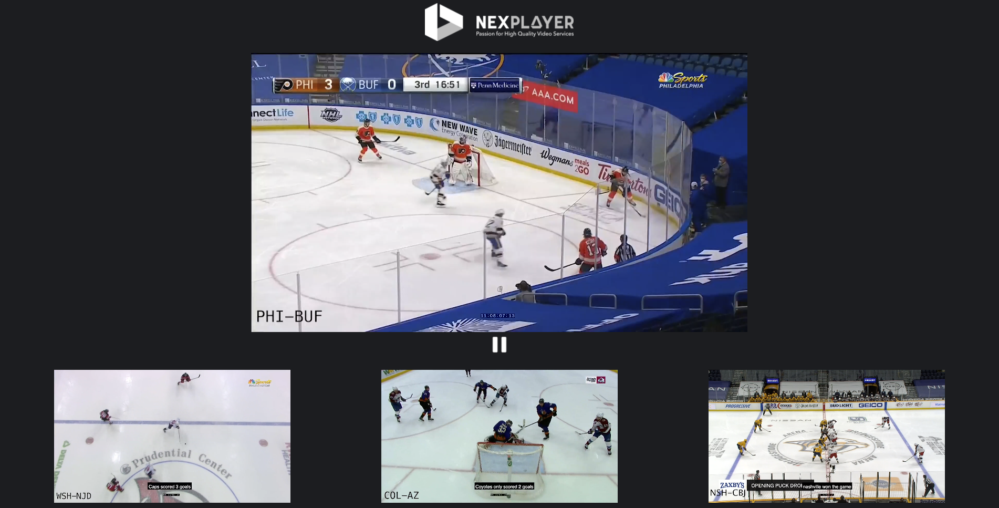

<a id="advance-top"> </a>

<a href="https://nexplayer.github.io/NexPlayer_HTML5_Documentation/#/"></a>

***

# Advance Usage

NexPlayer™ offers more advanced options to control the playback. This section contains several examples of how to use these features.

## Security

Digital rights management (DRM) is a set of access control technologies for restricting the use of proprietary hardware and copyrighted works.

<div class="alert alert-success hints-alert"><div class="hints-icon"><i class="fa fa-mortar-board"></i></div><div class="hints-container"><p>Most of the DRMs available won't work without using HTTPS with a certificate. For development purposes, a tool like <a style ="color:#5A5A5A!important" href="https://ngrok.com/" target="_blank">ngrok</a> can be used to test DRM-protected links.</p>
</div></div>

#### Supported Platforms

Online progressive download (MP4) is supported on any platform. The support for DASH and HLS, and associated DRMs, changes depending on each browser and platform. The platforms listed below are being continuously tested.

##### DASH

<table class="table table-sm">
 
  <tbody>
    <tr>
      <th class="titles" bgcolor="#C80000" scope="row">BROWSER </th>   
      <th class="titles" bgcolor="#C80000" scope="row">PLATFORM</th>        
      <th class="titles" bgcolor="#C80000" scope="row">DRM</th>        
    </tr>
    <tr>
      <th  scope="row">Chrome </th>      
      <th  scope="row">Windows, Linux, macOS, Android </th>      
      <th  scope="row">Widevine, Custom Headers </th>      
    </tr>
    <tr>
      <th  scope="row">Safari </th>      
      <th  scope="row">macOS </th>      
      <th  scope="row">X </th>       
    </tr>
    <tr>
       <th  scope="row">Firefox </th>      
      <th  scope="row">Windows, Linux, macOS, Android </th>      
      <th  scope="row">Widevine, Custom Headers </th>            
    </tr>
    <tr>
       <th  scope="row">Opera </th>      
      <th  scope="row">Windows, Linux, macOS </th>      
      <th  scope="row">Widevine, Custom Headers </th>       
    </tr>
     <tr>
       <th  scope="row">Edge </th>      
      <th  scope="row">Windows </th>      
      <th  scope="row">PlayReady, Custom Headers </th>       
    </tr>
     <tr>
       <th  scope="row">IE </th>      
      <th  scope="row">Windows <sup><a href="/#/advanceusage?id=fn_1" id="reffn_1">1</a></sup> </th>      
      <th  scope="row">PlayReady, Custom Headers </th>       
    </tr>
  </tbody>

  
</table>


<blockquote id="fn_1">
<sup>1</sup>. IE 11+ is required<a href="#reffn_2" title="Jump back to footnote [1] in the text."> </a>
</blockquote>

##### HLS

<table class="table table-sm">
 
  <tbody>
    <tr>
      <th class="titles" bgcolor="#C80000" scope="row">BROWSER </th>   
      <th class="titles" bgcolor="#C80000" scope="row">PLATFORM</th>        
      <th class="titles" bgcolor="#C80000" scope="row">DRM</th>        
    </tr>
    <tr>
      <th  scope="row">Chrome </th>      
      <th  scope="row">Windows, Linux, macOS, Android </th>      
      <th  scope="row">AES, Widevine, Custom Headers </th>      
    </tr>
    <tr>
      <th  scope="row">Safari </th>      
      <th  scope="row">macOS, iOS </th>      
      <th  scope="row">FairPlay, AES, Custom Headers </th>       
    </tr>
    <tr>
       <th  scope="row">Firefox </th>      
      <th  scope="row">Windows, Linux, macOS, Android </th>      
      <th  scope="row">AES, Widevine, Custom Headers </th>            
    </tr>
    <tr>
       <th  scope="row">Opera </th>      
      <th  scope="row">Windows, Linux, macOS </th>      
      <th  scope="row">AES, Widevine, Custom Headers </th>       
    </tr>
     <tr>
       <th  scope="row">Edge </th>      
      <th  scope="row">Windows </th>      
      <th  scope="row">AES, PlayReady, Custom Headers </th>       
    </tr>
     <tr>
       <th  scope="row">IE </th>      
      <th  scope="row">Windows <sup><a href="/#/advanceusage?id=fn_2" id="reffn_2">2</a></sup> </th>      
      <th  scope="row">AES, PlayReady, Custom Headers </th>       
    </tr>
  </tbody>

  
</table>

<blockquote id="fn_2">
<sup>2</sup>. IE 11+ is required<a href="#reffn_2" title="Jump back to footnote [1] in the text."> </a>
</blockquote>

NexPlayer™ supports several DRM technologies:
### Widevine
Is a DRM powered by <a href =https://www.widevine.com target="_blank">Google</a>, available on Chrome and Firefox (on Android and desktop), Opera, MS Edge and IE (on desktop). It can be set by entering the appropriate information into the DRM array:

```js
const nexDRMInformationWidevine = {
  NexDRMType:'com.widevine.alpha',
  NexDRMKey: 'DRM key URL',
  NexHeaders:[{FieldName: 'Optional field name', //Optional
               FiledValue: 'Optional field value'}] //Optional
};
nexplayer.Setup({
  key: 'REPLACE THIS WITH YOUR CUSTOMER KEY',
    div: document.getElementById('player'),
    src: 'VIDEO URL',
    drm: [nexDRMInformationWidevine]
});

```

Please note that the HTTP headers (NexHeaders) are optional, and might depend on the implementation of the Widevine server used.

<div class="alert alert-warning hints-alert"><div class="hints-icon"><i class="fa fa-warning"></i></div><div class="hints-container"><p>
Firefox<br>
In order for millions of Firefox users to continue viewing Widevine-protected digital video, they must be using version 88 or later. Version 88 is the current Firefox version, released by Mozilla on April 19, 2021. Users on older versions will be unable to stream Widevine-protected video once the older CDM is revoked.</p>
</div></div>

### Playready

A DRM powered by <a href =https://www.microsoft.com/playready/ target="_blank">Microsoft</a>, available on Edge and Internet Explorer (on Windows). It can be used by entering the appropriate information into the DRM array:

```js
const nexDRMInformationPlayReady = {
NexDRMType:'com.microsoft.playready',
 NexDRMKey: 'DRM key URL', 
NexHeaders:[{FieldName: 'Optional field name',  //Optional
            FiledValue: 'Optional field value'}]}; //Optional

nexplayer.Setup({
  key: 'REPLACE THIS WITH YOUR CUSTOMER KEY',
    div: document.getElementById('player'),
    src: 'VIDEO URL',
    drm: [nexDRMInformationPlayReady]
});
```
Please note that the HTTP headers (NexHeaders) are optional, and might depend on the implementation of the PlayReady server used.


### CENC

The Common Encryption Scheme (CENC) specifies the standard to enable decryption of the same file using different DRM systems. It allows the same CENC-encrypted content to be decrypted and played by any client device that interfaces with a DRM system that can serve the associated CENC key information.

```js
// Widevine
const nexDRMInformationWidevine = {NexDRMType:'com.widevine.alpha',
 NexDRMKey: 'DRM key URL', 
            NexHeaders:[{FieldName: 'Optional field name',  //Optional
            FiledValue: 'Optional field value'}]}; //Optional

// PlayReady
const nexDRMInformationPlayReady = {NexDRMType:'com.microsoft.playready',
 NexDRMKey: 'DRM key URL', 
            NexHeaders:[{FieldName: 'Optional field name', //Optional
            FiledValue: 'Optional field value'}]}; //Optional

nexplayer.Setup({
  key: 'REPLACE THIS WITH YOUR CUSTOMER KEY',
    div: document.getElementById('player'),
    src: 'VIDEO URL',
    drm: [nexDRMInformationWidevine, nexDRMInformationPlayReady]
});

```
For example, Widevine and PlayReady can be used with the same DASH manifest and chunk files:


### FairPlay

<a href =https://developer.apple.com/streaming/fps/ target="_blank">Is a DRM powered by Apple</a>, it's available on Safari (on macOS and iOS). When using FairPlay the license must be manually requested, adapting it to the specified FairPlay server implementation. It can be used by entering the information into the DRM array:
```js
// First get the player instance to call the necessary methods when the license is requested
var player = null;

// FairPlay Utility
function base64EncodeUint8Array(input) {
  var keyStr = "ABCDEFGHIJKLMNOPQRSTUVWXYZabcdefghijklmnopqrstuvwxyz0123456789+/=";
  var output = "";
  var chr1, chr2, chr3, enc1, enc2, enc3, enc4;
  var i = 0;

  while (i < input.length) {
      chr1 = input[i++];
      chr2 = i < input.length ? input[i++] : Number.NaN; // Not sure if the index
      chr3 = i < input.length ? input[i++] : Number.NaN; // checks are needed here

      enc1 = chr1 >> 2;
      enc2 = ((chr1 & 3) << 4) | (chr2 >> 4);
      enc3 = ((chr2 & 15) << 2) | (chr3 >> 6);
      enc4 = chr3 & 63;

      if (isNaN(chr2)) {
          enc3 = enc4 = 64;
      } else if (isNaN(chr3)) {
          enc4 = 64;
      }
      output += keyStr.charAt(enc1) + keyStr.charAt(enc2) +
          keyStr.charAt(enc3) + keyStr.charAt(enc4);
  }
  return output;
}

// Request the license at the NexPlayer callback
function licenseRequestReady (event) {
 var session = event.target;
 var message = event.message;
 var request = new XMLHttpRequest();
 var sessionId = event.sessionId;
 request.responseType = 'text'; // replace 'text' with 'arraybuffer' to use FairPlay Expressplay
 request.session = session;
 request.addEventListener('load', player.FairPlayNexLicenseRequestLoaded.bind(player), false);
 request.addEventListener('error', player.FairPlayNexLicenseRequestFailed.bind(player), false);
 var params = 'spc='+ encodeURIComponent(base64EncodeUint8Array(message)); // replace this variable with var params = new Uint8Array(message); to use FairPlay Expressplay
 request.open('POST', 'URL for the SPC sever (license server)', true); // serverProcessSPCPath
 request.setRequestHeader(“Content-type”, “application/x-www-form-urlencoded”); // replace “application/x-www-form-urlencoded” with “application/octet-stream” to use FairPlay Expressplay
 request.setRequestHeader(“dt-custom-data”, “Optional license token”);
 request.send(params);
}
var callBackWithPlayers = function (nexplayerInstance, videoElement) {
 player = nexplayerInstance;
}
var nexDRMInformationFairPlay = {NexDRMType:'com.apple.fps.1_0', NexDRMKey: 'DRM key URL or Base64 (certificate)', NexCallback: licenseRequestReady};
nexplayer.Setup({
 key: 'REPLACE THIS WITH YOUR CUSTOMER KEY',
 div: document.getElementById('player'),
 src: 'https://s3.amazonaws.com/shift72-temp/hls_fps_bento4_sintel/master.m3u8',
 callbacksForPlayer: callBackWithPlayers,
 drm: [nexDRMInformationFairPlay]
});
```
Please note that the HTTP headers (NexHeaders) are optional, and might be required depending on the implementation of the FairPlay server used.

FairPlay is supported with HLS.

### AES

NexPlayer™ supports HLS content encrypted with the AES-128 algorithm. If the key is transported inside the HLS manifest itself, it will automatically work without any modification on the developer's side.

Please note that this method is not as secure as other DRMs.

AES is supported with HLS
### Custom Headers
Custom headers can be included in each HTTP petition, even without the use of DRM, to include extra information for the server.

This information can be passed in the DRM array:

```js
drmCustomHeaders = {NexHeaders:[{FieldName: 'Optional field name', FiledValue: 'Optional field value'}]};

nexplayer.Setup({
  key: 'REPLACE THIS WITH YOUR CUSTOMER KEY',
    div: document.getElementById('player'),
    src: 'VIDEO URL',
    drm: [drmCustomHeaders]
});
```
Please note that this method is not as secure as other DRMs.

Custom headers are supported with HLS and DASH.
## Ads

NexPlayer supports the VAST, VPAID, and VMAP ad formats.

You can insert any pre/mid/post roll ad by setting up the ad links as shown below:
```js
nexplayer.Setup({
  key: 'REPLACE THIS WITH YOUR CUSTOMER KEY',
    div: document.getElementById('player'),
    src: 'VIDEO URL',
    vast: 'VAST / VPAID / VMAP link'
});
```
Sample VAST links can be found on the <a href =https://developers.google.com/interactive-media-ads/docs/sdks/html5/tags target="_blank">Google Interactive Media Ads Website</a>.

## 360 Player

This feature allows the player to play videos with equirectangular, cubemap or topdown format. 

If the device is an Oculus devices the flat 360 format must be used. 

For devices which use gyroscope, they can be moved to get a full 360 view of the video. However this feature  is only available for website that use the https protocol. 

In order to have the 360 in all devices you should add type_360: true and the player automatically set the correct type to the user device. An example of this is shown below:
```js
{
  div: document.getElementById('player'), // Mandatory
  src: 'URL video', // Mandatory
  type_360: true //'cubemap', 'flat', 'equirectangular' ...
}

```
<div class="alert alert-info hints-alert"><div class="hints-icon"><i class="fa fa-info-circle"></i></div><div class="hints-container"><p>Please note that the default format is 'equirectangular'. To switch the format, simply change the value of <b>type_360</b> to 'cubemap' or 'topdown'.</p>
</div></div>

<div class="alert alert-info hints-alert"><div class="hints-icon"><i class="fa fa-info-circle"></i></div><div class="hints-container"><p>Currently the only form to use the gyroscope is in web sites with https protocol, moreover in iOS devices you need to accept a permission to use this function</p>
</div></div>

<div class="alert alert-warning hints-alert"><div class="hints-icon"><i class="fa fa-warning"></i></div><div class="hints-container"><p>iOS 14 and iOS 14.1 don't support the 360 feature because there is an error in this versions</p>
</div></div>

## Muted at Start

This feature tells the player whether to start playback with the volume muted or not. This can be configured in the player by adding the mutedAtStart option:
```js
{
  div: document.getElementById('player'), // Mandatory
  src: 'URL video', // Mandatory
  mutedAtStart: true
}
```
<div class="alert alert-info hints-alert"><div class="hints-icon"><i class="fa fa-info-circle"></i></div><div class="hints-container"><p>Please note that the default value of the <b>mutedAtStart</b> parameter is false, so the player will start unmuted if <b>mutedAtStart</b> is not set to true.</p>
</div></div>

## Low Latency
This feature enables low latency for live streams. This can be configured in the player by adding the lowLatency option. You can also choose the desired latency:
```js
{
  div: document.getElementById('player'), // Mandatory
  src: 'URL video', // Mandatory
  lowLatency: true,// toggle on/off low latency apis
  lowLatencyLiveDelay: 3.2 // The desired latency to maintain
}
```
<div class="alert alert-info hints-alert"><div class="hints-icon"><i class="fa fa-info-circle"></i></div><div class="hints-container"><p>Please note that the default value of the <b>lowLatency</b> parameter is false, so the player will start without low latency if <b>lowLatency</b> is not set to true.</p>
</div></div>

<div class="alert alert-info hints-alert"><div class="hints-icon"><i class="fa fa-info-circle"></i></div><div class="hints-container"><p>Please note that the default value of the <b>lowLatencyLiveDelay</b> parameter will adjust the latency depending on the network conditions.</p>
</div></div>

## Autoplay

This feature enables/disables autoplay. This can be configured in the player by adding the autoplay option:

```js
{
  div: document.getElementById('player'), // Mandatory
  src: 'URL video', // Mandatory
  autoplay: false
}
```

<div class="alert alert-info hints-alert"><div class="hints-icon"><i class="fa fa-info-circle"></i></div><div class="hints-container"><p>Please note that the default value of the <b>autoplay</b> parameter is true, so the player will star without any user action. Note that most of the browsers will not allow autoplay without being muted at start.</p>
</div></div>

## Multiple Players
This feature enablles the use of multiple players at the same time. In order to create an other player it's necessary to create a new div.
```js
nexplayer.AditionalVideo({
    key: 'REPLACE THIS WITH YOUR CUSTOMER KEY',
    div: document.getElementById('playerN'), // Where "N" is the player number
    src: 'VIDEO URL',   
    callbacksForPlayer: callback(nexplayerInstance, videoElement)
});
```
In this example, the function AditionalVideo() has been called once for the extra video.<br>
It is necessary to create an aditional div and css class for every new player, also define a new "callbacksforPlayer".


## Casting

Cast technology allows you to stream your media to any compatible receiver devices.
### Chromecast

Chromecast displays your video and audio streams directly onto any TV connected to you Chromecast receptor. You can enable the Chromecast option as shown below:
 
 ```js
nexplayer.Setup({
  key: 'REPLACE THIS WITH YOUR CUSTOMER KEY',
    div: document.getElementById('player'),
    src: 'VIDEO URL',
    cast: {}
    chromecastEndImg: 'IMAGE URL'
});
 ```

It's possible to display an image after the video has finished using the chromecastEndImg parameter. Put the URL of the image you want to display and it'll be shown at the end of the video. Otherwise, a gray screen will be displayed when it finish.

### AirPlay
AirPlay displays your video and audio streams directly to your Apple TV. You can enable the AirPlay option as shown below:

```js
nexplayer.Setup({
  key: 'REPLACE THIS WITH YOUR CUSTOMER KEY',
    div: document.getElementById('player'),
    src: 'VIDEO URL',
    cast: {}
});
```
The AirPlay and Chromecast cast options don't need input parameters. Just remove the cast option to disable these features.

<div class="alert alert-success hints-alert"><div class="hints-icon"><i class="fa fa-mortar-board"></i></div><div class="hints-container"><p>Please note that AirPlay only works on Safari.</p>
</div></div>

## Timed Metadata

NexPlayer™ supports timed metadata for HLS and DASH content. The information is available in the <a href="https://developer.mozilla.org/en-US/docs/Web/API/TextTrack" target="_blank">TextTrack </a> array of the video element.

The following code is a sample to retrieve the metadata from the streams. It logs the active cues from the TexTrack corrsponding to the metadata.
```js
var callBackWithPlayers = function (nexplayerInstance, videoElement) {

    videoElement.textTracks.onaddtrack = function (e) {

        for (let i = 0; i < e.currentTarget.length; i ++) {      

            if (e.currentTarget[i].kind === "metadata") {  

                e.currentTarget[i].oncuechange = function (cueChangeEvent) {  

                    var activeCues = cueChangeEvent.currentTarget.activeCues;
                    if (activeCues) 
                        console.log("active cues: ", activeCues);
                };
            }
        }
    };
}

nexplayer.Setup({
  key: 'REPLACE THIS WITH YOUR CUSTOMER KEY',
  div: document.getElementById('player'),
  src: 'VIDEO URL',
  callbacksForPlayer: callBackWithPlayers
});
```

### ID3

ID3 is transported through .ts segments, usually in HLS.

### EMSG

This type of metadata is contained in fMP4 segments (DASH & HLS). You can consult more information <a href="https://aomediacodec.github.io/id3-emsg/" target="_blank">here</a>

## Access to the player instances

An instance of the player and the video element will be accessible once NexPlayer™ is configured and loaded. The 'callbacksForPlayer' option should be set. The defined function will be called when the player is considered ready. Once the callback is received, the playback can be controlled with the NexPlayer™ instance and the associated video element.

```js
var callBackWithPlayers = function (nexplayerInstance, videoElement) {
  // Eg. seeking to 30 sec from outside the predefined UI could be done like this
  nexplayerInstance.seek(30);
}

nexplayer.Setup({
  key: 'REPLACE THIS WITH YOUR CUSTOMER KEY',
  div: document.getElementById('player'),
  src: 'VIDEO URL',
  callbacksForPlayer: callBackWithPlayers
});

```
<div class="alert alert-success hints-alert"><div class="hints-icon"><i class="fa fa-mortar-board"></i></div><div class="hints-container"><p>We strongly recommend calling the APIs after the player is ready.</p>
</div></div>


## CSS Customization


### Player UI CSS Class Reference

### Introduction

This document provides an explanation of the UI and all the related CSS classes that can be modified to customize the default UI of the player.

### CSS Classes

| CSS Class | Description |
| --- | --- |
| .nexplayer_play_pause | Customize the play/pause button |
| .nexplayer_volume | Customize the volume button |
| .nexplayer_current_time | Customize the play/pause button |
| .nexplayer_airplay | Customize the AirPlay cast button |
| .nexplayer_language	 | Customize the full screen button |
| .nexplayer_full_screen | Customize the play/pause button |
| .nexplayer_total_time | Customize the total time text |
| .nexplayer_option_ui | Customize the language options menu |
| .nexplayer_logo_div | Customize the logo watermark |
| .nexplayer_playback_position | Customize the already played part of the seekbar |
| .nexplayer_bufferlevel_position | Customize the buffered part of the seekbar |
| .nexplayer_base_seekbar | Customize the default part of the seekbar |
| .nexplayer_circleBase | Customize the current postion marker of the seekbar |  

Please take into account that the seekbar and the volume control bar are the same component. So if you modify the .nexplayer_playback_position, .nexplayer_bufferlevel_position, .nexplayer_base_seekbar, or .nexplayer_circleBase css classes, then the volume control bar will change accordingly.

<div class="alert alert-success hints-alert"><div class="hints-icon"><i class="fa fa-mortar-board"></i></div><div class="hints-container"><p>Please note that to overwrite the styles, the JavaScript file should be imported before the desired customizations.</p>
</div></div>

### Responsive User Interface Configuration

The size of the UI adapts according to the size of the player. There are three different CSS classes that control this behavior:

| CSS Class | Description |
| --- | --- |
| .nexplayer_container | Main container |
| .nexplayer_container_normal | Standard size of the player > 768px |
| .nexplayer_container_mobile | Mobile size of the player > 461px |
| .nexplayer_container_tiny | Tiny size of the player < 461px |

Modifying the .nexplayer_container class will bring the changes to every platform. In order to customize individual or more platforms in a different way, the .nexplayer_container class should be followed by the desired platform class:

```
.nexplayer_container .nexplayer_container_normal <class to modify>

.nexplayer_container .nexplayer_container_mobile <class to modify>

.nexplayer_container .nexplayer_container_tiny <class to modify>

```

### Font

The font of the player can be customized using the following code:

```css
.nexplayer_container {
    font-size: 20pt;
    color: blue;
    font-family: sans-serif;
}

```

### Overwriting Styles

To overwrite the CSS styles of the default UI, the correct container name has to be added:

#### Button

```css
.nexplayer_container .nexplayer_container_normal .nexplayer_play_pause {
    background-color: yellow;
}

.nexplayer_container .nexplayer_container_mobile .nexplayer_play_pause {
    background-color: blue;
}

.nexplayer_container .nexplayer_container_tiny .nexplayer_play_pause {
    background-color: red;
}

```

#### Seekbar

```css
.nexplayer_container .nexplayer_circleBase {
    background-color: white;
}

.nexplayer_container .nexplayer_base_seekbar {
    background-color: blue;
}

.nexplayer_container .nexplayer_bufferlevel_position {
    background-color: yellow;
}

.nexplayer_container .nexplayer_playback_position {
    background-color: red;
}

```

### Modify the Selected Language Style

To customize the selected language style on the .nexplayer_option_ui menu, the following code should be used:

```css
.nexplayer_container .nexplayer_option_ui .nexplayer_selected_element {
    color: green;
}
```

### Control Bar Style

To customize the bottom control bar:

```css
.nexplayer_container .nexplayer_bar {
    background-color: green;
}

```

### Icon Changing

In order to change the default icons of the player, the following code should be used:

```css
.nexplayer_container .nexplayer_IconPause {
    background-image: url(replay.svg) !important;
}
```

Please note that we recommend using SVG icons. The list of all the CSS classes that defines the icons is:

| CSS Class | Description |
| --- | --- |
| .nexplayer_IconPlay | Play icon |
| .nexplayer_IconPause | Pause icon |
| .nexplayer_IconReset | Reset icon |
| .nexplayer_IconVolume | Volume icon |
| .nexplayer_IconMuted | Muted volume icon |
| .nexplayer_IconFullscreen | Full screen icon |
| .nexplayer_IconExitFullscreen	 | Exit full screen icon |
| .nexplayer_IconLanguage | Language options icon |
| .nexplayer_IconAirplay | AirPlay cast icon |
| .nexplayer_IconTriangle | The triangle below the .nexplayer_option_ui |

### Hover Effect Icons

Any icon has a predefined effect when the user hovers the mouse over or touches an icon.

This behavior can be customized with the hover selector on the .nexplayer_icon CSS class:

```css
.nexplayer_container .nexplayer_icon:hover {
    filter: drop-shadow(8px 8px 8px red);
}
```

## Custom Actions

Advanced actions can be performed with a player instance. For the full action list, check <a href="#/API" target="_blank">NexPlayer API</a>

### Adabtive Bitrate (ABR)

HLS and DASH streams contain several video bitrates in order to adjust the quality based on the network conditions. Changes in bitrate are done automatically when ABR (Adaptive Bitrate) is enabled (default behavior).

The currently selected track can be obtained with the method <code>getCurrentTrack</code>of NexPlayer™. It returns all the track information.

```js
nexplayerInstance.getCurrentTrack();
```
All the available tracks can be obtained with the method <code>getTracks </code> of NexPlayer™.

```js
nexplayerInstance.getTracks();
```

Setting a fixed track can be achieved by calling the method <code>setTrack</code> of NexPlayer™.

```js
// Sets the first track as the used one
nexplayerInstance.setTrack(nexplayerInstance.getTracks()[0].id);
```

A change in the current track can be detected with the NexPlayer™ <a href="#/advanceusage?id=callbacks" >callbacks</a>.

### Subtitles


Information about the available subtitles can be retrieved with the <code>textTracks</code> attribute of the video element.
```js
videoElement.textTracks;
```

The active subtitles mode is set to <code>showing</code>. The currently selected subtitle can also be selected by setting the mode to showing. A subtitle can be deselected by setting the mode to <code>hidden</code>.
```js
videoElement.textTracks[0].mode = "showing"; //0 -> the id of the textTrack
```

### Audio

Information about the current audio can be retrieved with the method <code>getCurrentAudioStream</code> of NexPlayer™. It returns all the audio information for that stream.

```js
nexplayerInstance.getCurrentAudioStream();
```

All the available audio tracks can be retrieved with the method <code>getAudioStreams</code> of NexPlayer™.

```js
nexplayerInstance.getAudioStreams();
```

The currently used audio stream can be set with the method <code>setAudioStream</code> of NexPlayer™, passing one of the IDs of <code>getAudioStreams</code>.

```js
// Sets the first audio stream as the used one
nexplayerInstance.setAudioStream(nexplayerInstance.getAudioStreams()[0].id);
```

### Seek

Seeking to a certain time can be achieved by calling the method <code>seek</code> of the NexPlayer™ and passing the desired number of seconds.

```js
nexplayerInstance.seek(30);
```

## Thumbnails
NexPlayer™ supports thumbnail previews. Thumbnails are individual frame images of the video that are loaded when a viewer hovers over the seekbar. It permits a quick snapshot of the video. The thumbnails can be loaded in a static or dynamic way.


###  Static Thumbnails

The player needs two files:
- The thumbnail sprite, which contains multiple thumbnails stitched together into a single image

- A .vtt file that specifies:
 - The range that the thumbnail represents.
 - The coordinates and size (both pixels) corresponding to the position in the previous image file

An example of the .vtt file could be:
```vtt
WEBVTT

00:00:00.000 --> 00:00:03.000
/assets/thumb_image.jpg#xywh=0,0,160,120
00:00:03.000 --> 00:00:08.000
/assets/thumb_image.jpg#xywh=162,0,160,120

```
<div class="alert alert-success hints-alert"><div class="hints-icon"><i class="fa fa-mortar-board"></i></div><div class="hints-container"><p>For development purposes, the npm package <a style ="color:#5A5A5A!important" href="https://www.npmjs.com/package/thumbnails-webvtt" target="_blank">thumbnails-webvtt</a> can be used to generate the thumbnails sprite and the .vtt file for a specific video.</p>
</div></div>

The player can be configured by adding the <b>staticThumbnailsImage</b> and <b>staticThumbnailsVTT</b> options:
```js
{
  div: document.getElementById('player'), // Mandatory
  src: 'URL video', // Mandatory
  staticThumbnailsImage: 'IMAGE SPRITE URL',
  staticThumbnailsVTT: 'VTT URL'
}
```

<div class="alert alert-info hints-alert"><div class="hints-icon"><i class="fa fa-info-circle"></i></div><div class="hints-container"><p>Please note that the time range specified in the .vtt file needs to be in (HH:)MM:SS.MMM format. Only this exact notation will be parsed.</p>
</div></div>

### Dynamic Thumbnails

This feature permits the player to dynamically download the frames from the lowest track of the video.
The player can be configured by adding the useDynamicThumbnails option:
```js
{
  div: document.getElementById('player'), // Mandatory
  src: 'URL video', // Mandatory
  useDynamicThumbnails: true
}
```

<a id="callbacks"></a>

## Callbacks

References to the <a href="#/advanceusage?id=access-to-the-player-instances">player instances</a> are needed to register callbacks.
There are two types of emitted events that can be listened to.

### Video Element Events

The video element emits the basic event, such as a change of the state of the video (such as pause/play/buffering), or informs that the current time of the video has changed.

0The method <code>addEventListener</code> of the video element needs to be called with any of the available <a href="https://developer.mozilla.org/en-US/docs/Web/Guide/Events/Media_events" target="_blank">media events</a>.

Some of the most important events are "playing", "pause", "waiting", and "timeupdate".

```js
videoElement.addEventListener("timeupdate", function() { console.log("The video playback has advanced to: "+videoElement.currentTime+", with the duration: "+videoElement.duration) }, true);
```

### Custom Events

We also have custom events to handle some different kind of video events.
```js
videoElement.addEventListener("customEvent", function() { console.log("Custom Event") });
```
##### fakeFSend

Sent when the video exits the fake full screen (useful in case of not using native fs).

##### audioChange

Sent when the audio of the video changes (language change).

##### subChange

Sent when the subtitles of the video changes (language change).

### Nexplayer Events

Advanced events such as a track change are available using the <code>on</code> method of NexPlayer.
 ```js
nexplayerInstance.on(nexplayer.Player.NexEvent.Track_Change, function(e) { console.log ("The current track has changed"),e.details()});                 
nexplayerInstance.on(nexplayer.Player.NexEvent.Speed_Change, function(e) { console.log("The current velocity has changed"),e.details()});
nexplayerInstance.on(nexplayer.Player.NexEvent.Error, function(e) { console.log("An error has occurred"),e.details()});
 ```

### Fullscreen iOS

If you want to avoid the fullscreen native player in iOS, you should define this using two callbacks on the setup <b>callbackFullscreenIn</b> and <b>callbackFullscreenOut</b>

```js
const callbackwithFullscreenIn = function(){
  document.getElementById('player_container').className = 'player_containerfs';
  }
const callbackwithFullscreenOut = function(){
  document.getElementById('player_container').className = 'player_container';
  }
nexplayer.Setup({
    key: 'REPLACE THIS WITH YOUR CUSTOMER KEY',
    div: document.getElementById('player'),
    src: 'VIDEO URL',
    callbackFullscreenIn: callbackwithFullscreenIn,
    callbackFullscreenOut: callbackwithFullscreenOut
  });
```
<div class="alert alert-info hints-alert"><div class="hints-icon"><i class="fa fa-info-circle"></i></div><div class="hints-container"><p>Please note that the code inside the callbacks its a sample, it can change depending the implementation.
</p>
</div></div>

## Closing Container
If you want to reuse the same div for different videos, the container div must be unmounted properly.
```js
nexplayer.UnMount(document.getElementById('player');
```
## Decreasing the Size of the Build

The nexplayer.js library is already minified, but to use even less space it's recommended to use gzip on the server where the library will be hosted. gzip is supported on the vast majority of servers.

The <a href="#releases">hosted versions</a> in our CDN use gzip.

## Cross-Origin Resource Sharing (CORS)

Cross-Origin Resource Sharing (CORS) is a mechanism that uses additional HTTP headers to let a user agent gain permission to access selected resources from a server on a different origin (domain) than the site currently in use.

This means that if a video is hosted in a different domain than the player, a header like <code>Access-Control-Allow-Origin: httрs://foo.mycompany.com </code> should be included in the response in order for it not to be blocked by the browser for security reasons. To allow all domains, set the header to <code>Access-Control-Allow-Origin: *</code>.

More information is available at <a href="https://developer.mozilla.org/en-US/docs/Web/HTTP/CORS" target = "_blank" >MDN Web Docs</a>.
## Upgrading to a New Version


When a specific version of the library is used, the URL of the hosted library should be upgraded. If the library is hosted on a custom server, replacing nexplayer.js is necessary. Here you can find the <a href="#/releases?" target = "_blank" >latest release</a>.

Every new release of NexPlayer™ is backwards compatible.

## Integration

### Conviva Analytics

 <a href="https://www.nexplayersdk.com/nexplayer-html5/" target = "_blank" >NexPlayer™ HTML5</a> is a multi-screen streaming player that enables HLS and DASH live streaming across all browsers and platforms with the highest video quality. NexPlayer™ HTML5 supports an advanced feature set that includes DRM, Closed Captioning, Time Shifting and 360 video playback among many others.

This repository contains the sample demo code of NexPlayer™ HTML5 with the integration of  <a href="https://www.conviva.com/" target = "_blank" >Conviva</a>.A fully working demo can be downloaded on this github <a href="https://github.com/NexPlayer/NexPlayer_HTML5_Conviva" target = "_blank" >repository</a>.

#### Quick Start
- The folders "app" and "conviva" include the scripts that should be included in the HTML file:
```js
<script type="text/javascript" src="conviva/conviva-core-sdk.min.js"></script>
<script type="text/javascript" src="conviva/conviva-html5native-impl.js"></script>
<script type="text/javascript" src="app/configs.js"></script>
<script type="text/javascript" src="app/NexHandshake.js"></script>
```
- Configure your settings in "app/configs.js".
- NexHandshake should be created after the event "loadeddata" is fired. This object preintegrates the Conviva client and will handle the analytic sessions.

```js
var NexConviva = null;

...
videoElement.addEventListener('loadeddata', loadModules, false);
...

function loadModules() {
  NexConviva = new NexHandshake(videoElem, url, player.isLive(), true);
  NexConviva.initConvivaClient();
  NexConviva.createContentSession();
  NexConviva.updateBitrateData(player.getCurrentTrack().bitrate / 1000);
  // Use this in order to update the bitrate data every time a track changes
  player.on(nexplayer.Player.NexEvent.Track_Change, function() {
    NexConviva.updateBitrateData(player.getCurrentTrack().bitrate / 1000);
  });
  // Example of creating a custom tag
  NexConviva.createCustomTag("a", "20", false);
  // It is necessary to call this method to update the metadata on Conviva side
  NexConviva.updateContentMetadata();
}
```
- To destroy and reset the current Conviva session the following code should be used:

```js
NexConviva.cleanupContentSession();
```
This is already called in NexHandshake.js file, but it can be modified and be called whenever it is wanted to clean up the session.

##  MultiView

### Demo
  You can see the multiview demo <a href="https://nex360.s3.amazonaws.com/MultiView/index.html">here</a>:
  

### Sample
 Multi-view playback integrated in html5:

 ```html
<!DOCTYPE html>
<html>
<head>
	<meta charset="UTF-8">
	<meta name="viewport" content="width=device-width, initial-scale=1.0, maximum-scale=1.0, user-scalable=no" />
	<title>NexPlayer</title>
	<style type="text/css">
		body {
			background-color: #1E1F23;
		}
		#player_container {
			width: 90%;
			margin: auto;
			padding-top: 50.625%;
			/* 16:9 Aspect Ratio 56.25 * 0.9 */
			position: relative;
			background-color: rgba !important;
		}
		#player_container2,
		#player_container3,
		#player_container4 {
			width: 90%;
			margin: auto;
			padding-top: 40.625%;
			/* 16:9 Aspect Ratio 56.25 * 0.9 */
			position: relative;
			background-color: rgba !important;
		}
		#global_container {
			display: flex;
			justify-content: space-around;
		}
		#player_container_360 {
			width: 90%;
			margin: auto;
			position: relative;
			padding-top: 50.625%;
			/* 16:9 Aspect Ratio 56.25 * 0.9 */
		}
		@media (min-width: 75rem) {
			#player_container {
				width: 50%;
				padding-top: 28.125%;
				/* 16:9 Aspect Ratio 56.25 * 0.5 */
			}
			#player_container2,
			#player_container3,
			#player_container_360,
			#player_container4 {
				width: 25%;
				padding-top: 22.125%;
				/* 16:9 Aspect Ratio 56.25 * 0.5 */
			}
		}
		h1 {
			text-align: center;
		}
		#player {
			background-color: black;
			position: absolute;
			top: 0px;
			width: 100%;
			height: 100%;
		}
		#player2,
		#player3,
		#player4 {
			background-color: black;
			position: absolute;
			top: 0px;
			width: 100%;
			height: 100%;
		}
		.box {
			padding-top: 2%;
			display: flex;
			justify-content: space-between;
		}
	</style>
</head>
<body>
	<div id="player_container">
		<div id="player" width="530" height="315"></div>
	</div>
	<div id="global_container">
		<div id="player_container2">
			<div id="player2" width="530" height="315"></div>
		</div>
		<div id="player_container3">
			<div id="player3" width="530" height="315"></div>
		</div>
		<div id="player_container4">
			<div id="player4" width="530" height="315"></div>
		</div>
	</div>
	<script src="https://nexplayer.nexplayersdk.com/multiview/nexplayer.js"></script>
	<script>
		
    var multiView = new nexplayer.MultipleView();

    var callBackWithPlayers = function (nexplayerInstance, videoElement) {
		};

		multiView.additionalVideo({
			key: "Your licence key",
			allowScreenPlayPause: false,
			callbacksForPlayer: callBackWithPlayers,
			debug: false,
			div: document.getElementById('player'),
			hideScreenPlay: false,
			lowLatency: true,
			showingFullUI: false,
			src: 'Your stream URL',
		});

		multiView.additionalVideo({
			key: "Your licence key",
			allowScreenPlayPause: false,
			callbacksForPlayer: callBackWithPlayers,
			debug: false,
			div: document.getElementById('player2'),
			hideScreenPlay: false,
			lowLatency: true,
			showingFullUI: false,
			src: 'Your stream URL',
		});

		multiView.additionalVideo({
			key: "Your licence key",
			div: document.getElementById('player3'),
			callbacksForPlayer: callBackWithPlayers,
			allowScreenPlayPause: false,
			showingFullUI: false,
			hideScreenPlay: false,
			lowLatency: true,
			debug: false,
			src: 'Your stream URL',
		});

		multiView.additionalVideo({
			key: "Your licence key",
			div: document.getElementById('player4'),
			callbacksForPlayer: callBackWithPlayers,
			allowScreenPlayPause: false,
			debug: false,
			hideScreenPlay: false,
			showingFullUI: false,
			lowLatency: true,
			src: 'Your stream URL',
		});

     multiView.Initialize();
     
	</script>
</body>
</html>
```
### Step-by-Step

To integrate NexPlayer™ multiview into your project you must complete the following steps:

- The NexPlayer™ JavaScript library should be included in the HTML file:

```html
<script src="https://nexplayer.nexplayersdk.com/multiview/nexplayer.js"></script>
```
<div class="alert alert-warning hints-alert"><div class="hints-icon"><i class="fa fa-warning"></i></div><div class="hints-container"><p>The library above is a test version, the official version will be in the next release.</p>
</div></div>
<div class="alert alert-success hints-alert"><div class="hints-icon"><i class="fa fa-mortar-board"></i></div><div class="hints-container"><p>Please note that the use of https to call our library is mandatory. </p>
</div></div>

- A div that will contain the videos and the UI has to be declared:
```html
<body>
    <div id="player_container">
       <div id="player" width="530" height="315"></div>
    </div>
    <div id="global_container">
       <div id="player_container2">
           <div id="player2" width="530" height="315"></div>
       </div>
       <div id="player_container3">
           <div id="player3" width="530" height="315"></div>
       </div>
       <div id="player_container4">
           <div id="player4" width="530" height="315"></div>
       </div>
    </div>
</body>
```
- To create the players we will have to call multiview.additionalVideo() after callBackWithPlayers is created so that the players are initialized sequentially:
```js
 var multiView = new nexplayer.MultipleView();

    var callBackWithPlayers = function (nexplayerInstance, videoElement) {
      
		};

		multiView.additionalVideo({
			key: "Your licence key",
			allowScreenPlayPause: false,
			callbacksForPlayer: callBackWithPlayers,
			debug: false,
			div: document.getElementById('player'),
			hideScreenPlay: false,
			lowLatency: true,
			showingFullUI: false,
			src: 'Your stream URL',
		});

		multiView.additionalVideo({
			key: "Your licence key",
			allowScreenPlayPause: false,
			callbacksForPlayer: callBackWithPlayers,
			debug: false,
			div: document.getElementById('player2'),
			hideScreenPlay: false,
			lowLatency: true,
			showingFullUI: false,
			src: 'Your stream URL',
		});

		multiView.additionalVideo({
			key: "Your licence key",
			div: document.getElementById('player3'),
			callbacksForPlayer: callBackWithPlayers,
			allowScreenPlayPause: false,
			showingFullUI: false,
			hideScreenPlay: false,
			lowLatency: true,
			debug: false,
			src: 'Your stream URL',
		});

		multiView.additionalVideo({
			key: "Your licence key",
			div: document.getElementById('player4'),
			callbacksForPlayer: callBackWithPlayers,
			allowScreenPlayPause: false,
			debug: false,
			hideScreenPlay: false,
			showingFullUI: false,
			lowLatency: true,
			src: 'Your stream URL',
		});

     multiView.Initialize();
     
```
- There are some functions available to use, consult the <a href="#/API?id=multiview" target = "_blank" >api</a>

### Synchronization

To be able to use the synchronization we have to configure in the setup the ```lowLatency``` and ```liveSettings```.

```javascript
  
   multiView.additionalVideo({
          key: "Your licence key",
          div: document.getElementById('player4'),
          callbacksForPlayer: callBackWithPlayers,
          lowLatency: true,
          liveSettings: { // Optional: Allow modifying the following properties
		      	"liveDelay": 6, // Allow adjusting the live delay
		      	"maxDrift": 10, // The maximun delay before to make a seek live
		      	"playbackRate": 0.5, // The speed that the player gets in order to keep the live delay
		      },
          src: 'Your stream URL',
      });
      
```
<div class="alert alert-warning hints-alert"><div class="hints-icon"><i class="fa fa-warning"></i></div><div class="hints-container"><p>Currently, live synchronization is only available for Dash.</p>
</div></div>

##  YouTube

### Sample
    
  YouTube API integrated in html5

  ```html
  <!DOCTYPE html>
<html>

<head>
	<meta charset="UTF-8">
	<meta name="viewport" content="width=device-width, initial-scale=1.0, maximum-scale=1.0, user-scalable=no" />
	<title>NexPlayer</title>
	<style type="text/css">

		#player_container {
			width: 90%;
			margin: auto;
			padding-top: 50.625%;
			/* 16:9 Aspect Ratio 56.25 * 0.9 */
			position: relative;
			background-color: rgba !important;
		}

		#player {
			background-color: black;
			position: absolute;
			top: 0px;
			width: 100%;
			height: 100%;
		}

	</style>

</head>

<body>
	<div id="player_container">
		<div id="player" width="530" height="315"></div>
	</div>

	<script src="NexPlayer Library"></script>
	<script>

		var YouTubePlayer = new nexplayer.YouTubePlayer();

		var player;

		YouTubePlayer.init("REPLACE THIS WITH YOUR CUSTOMER KEY");
	
			function onYouTubeIframeAPIReady() {
			player = new YT.Player("player", {
				height: '360',
				width: '640',
				startSeconds: 0,
				videoId: YouTubePlayer.URL('https://www.youtube.com/watch?v=Yelb7w9cjVg'),
				events: {
					'onReady': onPlayerReady,
				}
			});
	}

		function onPlayerReady(event) {
			event.target.playVideo();
		}

	</script>
</body>
</html>
```

### Step-by-Step
To integrate NexPlayer™ YouTube into your project you must complete the following steps:

- The NexPlayer™ JavaScript library should be included in the HTML file:

```html
<script src="NexPlayer Library"></script>
```

<div class="alert alert-success hints-alert"><div class="hints-icon"><i class="fa fa-mortar-board"></i></div><div class="hints-container"><p>Please note that the use of https to call our library is mandatory. </p>
</div></div>

A div that will contain the videos and the UI has to be declared:

```html
<div id="player_container">
		<div id="player" width="530" height="315"></div>
	</div>
```
To create the youtube player we first need to declare the youtube class. Once created, we declare a <a href="https://developers.google.com/youtube/iframe_api_reference" target="_blank">variable</a>, which is the one that will host all the YouTube methods.

```js
var YouTubePlayer = new nexplayer.YouTubePlayer();
var player;
```
Once the player is initialized we create a function that will load the content of the video. Using the previous variable, we are going to set the YouTube instance.

```js
YouTubePlayer.init("REPLACE THIS WITH YOUR CUSTOMER KEY");

  function onYouTubeIframeAPIReady() {
		player = new YT.Player("player", {
		  height: '360',
			width: '640',
			startSeconds: 0,
			videoId: YouTubePlayer.URL('https://www.youtube.com/watch?v=Yelb7w9cjVg'),
		});
	}
```
## Multiple Sources

This feature, as long as src is undefined, allows the player to choose a playable src from one of the objects contained in the srcSets array depending on the browser and device support. Furthermore, this enhancement will automatically skip those streams that may fail during playback and try to restart it taking any of the following videos provided in the property previously mentioned.


```js
nexplayer.Setup({
    key: 'REPLACE THIS WITH YOUR CUSTOMER KEY',
    div: document.getElementById('player'),
    src: 'video URL',
    drm: [{
        NexDRMType:'DRM Type (eg. com.widevine.alpha)', NexDRMKey: 'URI for the DRM Key', 
        NexHeaders:[{FieldName: 'Header Field Name', FiledValue: 'Header Field Value'}],
        NexCallback: // Optional DRM callback for FairPlay
    }], // Optional: DRM information
    srcSets:[
      {
        src: 'video URL',
        drm: {
            NexDRMType:'DRM Type (eg. com.widevine.alpha)', NexDRMKey: 'URI for the DRM Key', 
            NexHeaders:[{FieldName: 'Header Field Name', FiledValue: 'Header Field Value'}],
            NexCallback: // Optional DRM callback for FairPlay
        } // Optional: DRM information or undefined
      },
      {
        src: 'other video URL',
        drm: 'undefined'
      },
    ...
  ] // Optional: Objects array containing a stream and an optional DRM.
});
```

## iOS WebView

Here is the example code to create a simple application

```swift
  import UIKit
  import WebKit
  class ViewController: UIViewController, WKUIDelegate {
    
    var webView: WKWebView!
    
    override func loadView() {
      let webConfiguration = WKWebViewConfiguration()
        webView = WKWebView(frame: .zero, configuration: webConfiguration)
        webView.uiDelegate = self
        view = webView
    }
    override func viewDidLoad() {
        super.viewDidLoad()
        
        let myURL = URL(string:"Your url")
        let myRequest = URLRequest(url: myURL!)
        webView.load(myRequest)
    }}

```
For the video to start playing, you will need to configure the following parameters

```swift
    override func loadView() {
      let webConfiguration = WKWebViewConfiguration()
      webConfiguration.preferences.javaScriptEnabled = true
      webConfiguration.mediaPlaybackRequiresUserAction = false
      webConfiguration.allowsInlineMediaPlayback = true
      webView = WKWebView(frame: .zero, configuration: webConfiguration)
      webView.uiDelegate = self
      view = webView
    }

```